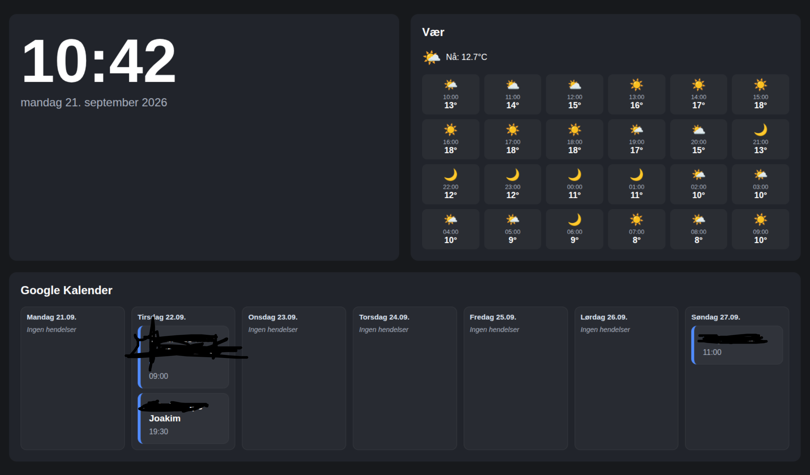

# Raspberry Pi 3 info screen
This is a personal setup that I use at home, with my Raspberry Pi 3, to get some info we need on a day-to-day basis

### Prerequisites
Make sure you have the rust installed using this command:
#### Rust
```bash script
rustc --version
```

#### Cargo
Make sure you have cargo installed using this command:
```bash script
cargo --version
```

### Build
Build the code without running it
```bash script
cargo build
```

#### Running the application locally
```bash script
cargo run
```
Avaiable at
http://localhost:8080


### Run on startup Raspberry Pi 3
```bash script
sudo nano /etc/systemd/system/rust_app.service
```
and paste this content:

```
[Unit]
Description=My Rust Cargo Application
After=network.target

[Service]
Type=simple
User=joakim
WorkingDirectory=/home/joakim/git/priv/raspberry-pi-3-info-screen
Environment="GOOGLE_CLIENT_ID=your-client-id.apps.googleusercontent.com"
Environment="GOOGLE_CLIENT_SECRET=your-google-client-secret"
Environment="SLIDESHOW_DIRECTORY=/home/joakim/Pictures/info-screen"
Environment="SLIDESHOW_INTERVAL_SECONDS=30"
ExecStart=/home/joakim/.cargo/bin/cargo run --release
Restart=on-failure

[Install]
WantedBy=multi-user.target
```
Then
```bash script
sudo systemctl daemon-reload
```
```bash script
sudo systemctl enable rust_app.service
```
```bash script
sudo systemctl start rust_app.service
```

Verify the Service Status
```bash script
sudo systemctl status rust_app.service
```

check logs
```bash script
journalctl -u rust_app.service -f
```

### Example output 


# Launch in kiosk mode on the Raspberry Pi 3
``` bash
firefox \
--kiosk \
http://localhost:8080
```
